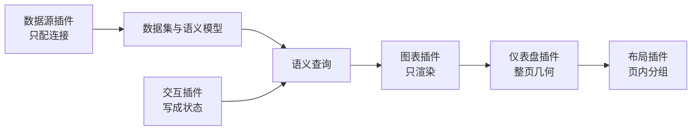

# 为什么方便二开

DataLuminary 的产品定位是 **方便二次开发**：行业图表、数据源、筛选控件和版式不写进内核。宿主只保留编辑器壳、查询通道、权限和状态；差异放进插件。

选它做公司 BI，看的不是「能不能再做一个柱状图」，而是扩展会不会拆掉口径、权限和发布链路。

## 内核留下什么

| 宿主负责 | 插件负责 |
|----------|----------|
| 编辑器、查看页、嵌入页 | 某一种可视化、连接表单、筛选控件或版式 |
| 数据集与语义查询 | 把查询结果画出来，或把连接信息交给后端 |
| 权限、分享、订阅 | 不另做一套鉴权和分发 |
| 仪表盘运行时状态 | 把用户操作写成状态，或只渲染 |

二开加的是插件。改内核才动查询、权限和资源模型。

## 三十秒看扩展面

五类插件各吸收一类差异：

| 插件 | 你扩展的是 | 你不能扩展成 |
|------|------------|----------------|
| 数据源 | 一种新的连接方式 | 图表直接 `query()` 这条库 |
| 图表 | 一种新的可视化或装饰 | 自己的取数通道、自己的 SQL |
| 交互 | 一种新的筛选控件 | 图表之间的事件总线，或跳转按钮 |
| 仪表盘 | 一种整页几何 | 页内的分组方式 |
| 布局 | 一种页内容器 | 另一套整页坐标系 |

打开另一张仪表盘或外链，配置在版本级交互规则里，不另做一类插件。

## 架构师怎么拍板

选 DataLuminary，得到的是同一条链上的扩展，不是一个可以随便改的报表运行时。

**得到**

- 新图表、新数据源、新筛选、新版式，按契约加插件，不必改编辑器壳。
- 图表属性用 Schema 描述，人和 AI 改的是同一份配置，不是每个插件一套临时状态。
- 前后端、插件和查询结构都是 TypeScript。定制和审查不用先翻译一层语言。
- 口径在数据集和语义模型上。换图表不会换一套指标定义。
- 身份只回答「你是谁」；空间里能看什么由产品自己的权限计算。插件插不进 ACL。

**必须接受**

- 图表不直连业务库。要新的库，同时补连接配置和后端连接器，再在数据集上建模。
- 筛选是运行时状态，由引擎派生各图的附加条件。不能做成图表互相监听。
- 自由大屏是固定逻辑尺寸加等比缩放。要随内容变高，用网格布局，不要改自由布局。
- 内置插件打进前端包，静态注册。不要指望运行时远程脚本拼出页面。
- 用户画布的颜色由用户决定。产品外壳的工业蓝不延伸到客户的大屏。

更细的取舍见 [关键选型](./decisions.md)。动手前先过 [二开红线](./constraints.md)。

## 和另外几类 BI 的差别

| 类型 | 二开通常改哪里 | DataLuminary |
|------|----------------|--------------|
| 监控看板 | 图表自带查询编辑器 | 图表只渲染；查询在数据集和语义层 |
| SQL 探索 | 每个图一份 SQL | 口径在语义模型，图绑定数据集 |
| 开箱报表 | 改产品里的图表实现 | 场景差异进插件，内核保持查询、权限、发布 |

对照表见 [竞品对比](/migrate/compare)。

## 按角色继续

| 你是 | 下一步 |
|------|--------|
| 架构师、技术主管 | [关键选型](./decisions.md)，然后用上面的「必须接受」做否决项 |
| 要写插件的人 | [二开红线](./constraints.md)，再进对应手册 |
| 只查某一类概念 | [从这里开始](./index.md) |
