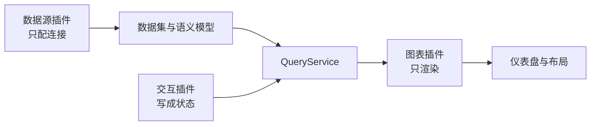

# 设计理念

DataLuminary（数据明鉴）是面向 AI 时代的开源 BI 数据洞察平台。它把数据接入、语义建模、可视化表达、权限协作和 AI 洞察收成一条可复用的链路：产品、运营、分析师和管理者不必先成为专业开发者，也能做出可编辑、可审计、可交付的分析。

它可以单独部署，也可以作为 [LuminaryWorks](https://luminaryworks.dev) 生态里的数据洞察中枢。能力清单见 [产品概览](/product/)，技术选型见 [架构概览](/develop/architecture)。

## LessCode：三种方式，同一套资产

日常分析不要求先写代码。清洗与口径放在数据集，表达放在图表和仪表盘，解释交给 AI。三种用法共用同一套资源，所以结果能继续改、能发布、能授权、能嵌入，而不是各留一份草稿。

| 方式 | 谁在用 | 落在哪 |
|------|--------|--------|
| 拖拽完成 | 业务、运营、产品、管理者 | 图表与仪表盘配置 |
| 与 AI 分步骤打磨 | 分析师、BI、研发 | 同一套数据集、指标、图表 |
| 一句话生成 | 管理者、一线团队 | 可继续编辑的原生草案 |

AI 写出的是平台配置，不是另一套报表。数字来自平台查询，不来自模型凭空作答。见 [AI 洞察](/product/ai-insights)。

## 微内核 + 插件

行业图表、数据源和版式不写进内核。宿主只保留编辑器壳、查询通道、权限和状态；场景差异由插件吸收。

| 插件 | 负责 | 不负责 |
|------|------|--------|
| 数据源 | 连接配置与连通测试 | 向图表直接供数 |
| 图表 | 把查询结果画成视图 | 自己连库、自己拼 SQL |
| 交互控件 | 把筛选写成仪表盘状态 | 图表之间互相抛事件 |
| 仪表盘 | 整页几何：网格、自由大屏、列表 | 页内分组 |
| 布局 | 页内分组：行、标签、轮播 | 改整页坐标系 |



数据必须经过数据集。图表不直连数据源，也不调用数据源上的 `query()`。这是和「图表自带查询编辑器」的分界，也是和历史方案的分界。契约见 [插件核心概念](/plugins/)。

## 数据集是分析入口

数据集不是物理表的别名。图表、仪表盘和问数都绑数据集，口径绑已发布的语义模型。

```text
数据源插件（只配连接）
  → 数据集（一张表，或受控联表）
  → 语义模型（指标 / 维度，创建时自动发布）
  → 图表、仪表盘、AI 问数
```

- 创建时默认自动发布语义模型，图表跟随**最新已发布**版本，不再为每张图另写字段名或图表 SQL。
- 联表发生在治理层：平台按已登记的原始数据集编译 JOIN，用户不提交任意 SQL。
- 默认直接查询业务库。需要加速时，连接自备分析库，由平台同步。托管分析存储默认关闭。

内置连接包括 MySQL、PostgreSQL、SQL Server、ClickHouse 与 Excel。用户说明见 [数据集与分析存储](/product/dataset-modeling)。

## 交互是状态，不是事件网

一次筛选、点击或下钻，先写成仪表盘上的状态，再由引擎派生各图该附加的条件。条件没变的图不请求、不重绘。图表之间不互相监听。

由此固定几条约束：

- 划过只做短暂强调，不筛数、不跳转。
- 数据点点击的优先级是：下钻，然后联动，然后交互规则。
- 打开另一张仪表盘或外链，配置在交互规则里，不另做一套跳转控件。
- 装饰层默认点不中；只有配了交互或声明可点击的热点才接收点击。

说明见 [仪表盘交互能力](/product/dashboard-interactions)。

## 用契约把扩展收在一条链上

插件可以增加，口径不能散。前后端、插件元数据和查询结构都用 TypeScript 对齐：

- 插件用 `kind` / `mode` 声明自己是数据源、图表、交互、仪表盘还是布局，由宿主静态注册。
- 查询请求、语义字段、分享与嵌入令牌走同一套契约，避免前端猜一套、后端另写一套。
- 内置插件打进 DataView；编辑态与交互态在 Zustand。不靠运行时远程脚本拼页面。

语言面与框架选型见 [架构概览](/develop/architecture)。

## 故意不做的事

- 不把每个行业的图表和配色写进内核。行业差异走插件和场景模板；用户画布的颜色由用户决定。
- 不把资源权限写进登录令牌。统一账号或企业 SSO 只回答「你是谁」；空间里能看什么，由产品自己计算。见 [统一身份与企业 SSO](/product/unified-identity)。
- 自由布局大屏不做「高度随内容撑高」。大屏是固定逻辑尺寸加等比缩放；需要滚动的分析用网格布局。见 [自由布局固定尺寸](/product/position-layout-fixed-canvas)。

## 延伸阅读

- [产品概览](/product/) · [产品愿景](/product/vision) · [完整产品能力](/product/features)
- [架构概览](/develop/architecture) · [为什么方便二开](/plugins/why-extend) · [关键选型](/plugins/decisions) · [插件入口](/plugins/)
- [LuminaryWorks 生态](/product/ecosystem)
